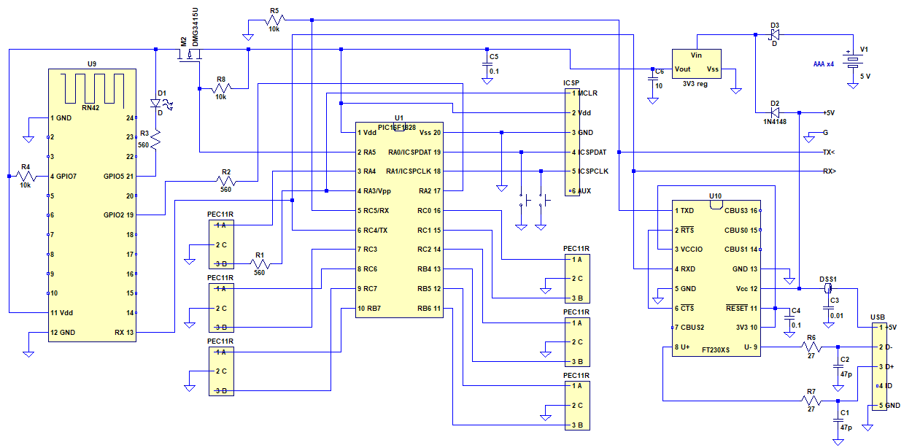
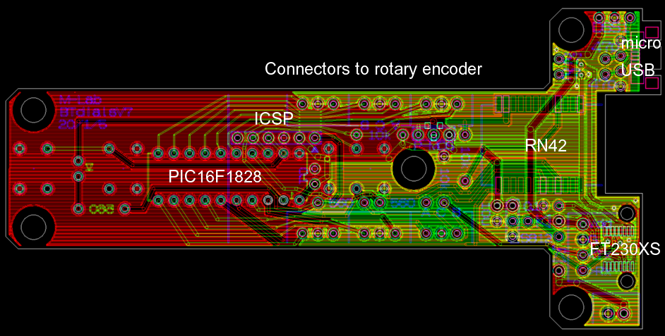
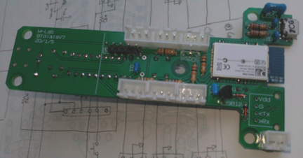
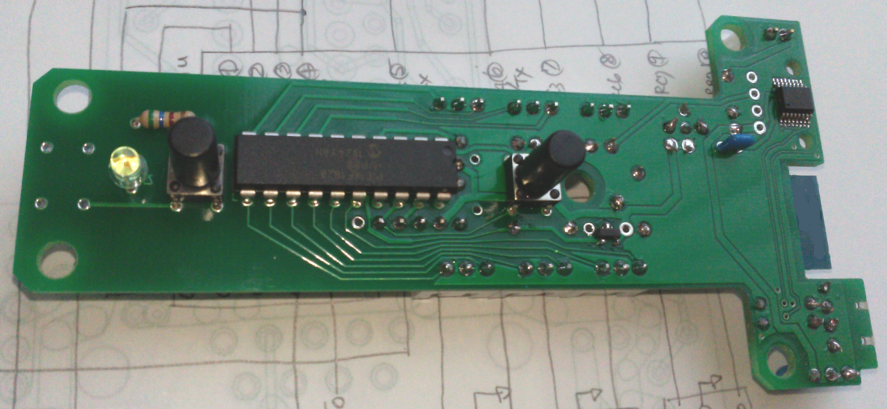
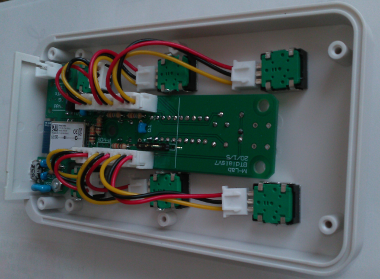
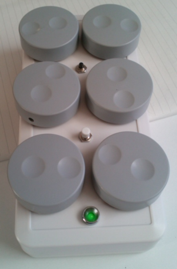
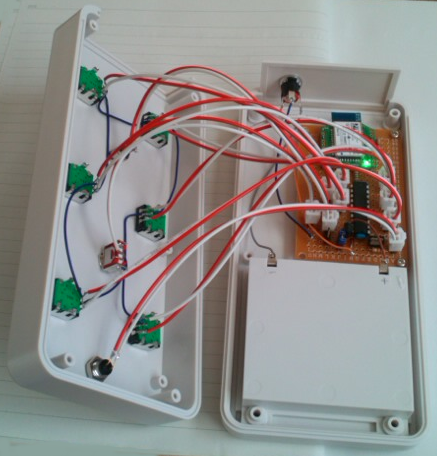

# Bluetooth Dials

The left one is the USB model shown here and the right one is the former 
<a href="https://github.com/mizutanilab/BluetoothDialsRS232C">RS232C model</a>.
 

Bluetooth Dials is a wireless input device for operating multiple parameters with dials and buttons. We use this device to rotate 3D structures, move them along the x/y/z axes, adjust the contrast and brightness, zoom in/out, move movie frames forward/backward, and so on. It has dials and buttons and sends your operation through its Bluetooth interface or USB port to your PC. In 1990's, dial/button boxes were commercially available from graphics workstation manufacturers, but today we can't find such multiple-dial devices. The most similar one is Microsoft Surface Dial, but it has only one knob, so it does not meet our needs. Bluetooth Dials is a wireless version of the historic dial/button box. It's compatible with our <a href="https://github.com/mizutanilab/RecView">RecView</a> and <a href="https://github.com/mizutanilab/MCTrace">MCTrace</a> softwares. We usually use a mouse with the right hand and this device with the left hand to operate our softwares. 

Six knobs are used for changing parameters. Two buttons are used for toggling some functions. The lower button is also used for turning on and off the device. The green LED blinks when the Bluetooth interface is ready, or turns on when the link is established.   

The Bluetooth interface of this device is RN42 (Roving Networks / Microchip). A host-side interface previously we used is MM-BTUD43 (Sanwa Supply) dongle that seems to have a CSR chip. Built-in Bluetooth interfaces of our laptop PCs also work well with the device. 

## Firmware
The firmware sends dial/button operations to USB COM port or to virtual COM port associated with the Bluetooth interface. You can find the COM port in the Dialbox dialog of RecView and MCTrace. The virtual COM port number of the Bluetooth interface can also be found from: Bluetooth icon in the lower right -> show devices -> other options -> COM port tab.  

In the default boot, Bluetooth sniffing with a 500 ms interval is enabled (RN42 command: SW,0320) to reduce the battery consumption, but a certain laptop seems not compatible with sniffing. The sniffing is disabled by pressing the lower button while setting batteries. If it's connected with a USB cable, the Bluetooth interface gets turned off. 

## Schematic
 
There's nothing special. The MCU (PIC16F1828) receives signals from rotary encoders (PEC11R, Bourns) and push buttons (B3F, Omron), and sends those information through the UART TX line to the Bluetooth module (RN42) and to the USB interface (FT230XS). The device operates with four AAA batteries, or with DC current draw from USB. You can omit either RN42 or FT230XS if it's not needed.   

## PCB gerbers
Gerber files are available from the <a href="https://github.com/mizutanilab/BluetoothDials/tree/master/gerber">gerber</a> folder.   
 
  
A few blank circuit boards are available (only for researchers of academic institutions).  

## BOM
<table>
<tr><th>Item</th><th>Description</th><th>Brand</th><th>QTY</th></tr>
<tr><td>MCU</td><td>PIC16F1828</td><td>Microchip</td><td>1</td></tr>
<tr><td>Bluetooth interface</td><td>RN42</td><td>Microchip</td><td>1</td></tr>
<tr><td>USB interface</td><td>FT230XS</td><td>FTDI</td><td>1</td></tr>
<tr><td>3V3 regulator</td><td>S-812C33AY-B-G</td><td>ABLIC</td><td>1</td></tr>
<tr><td>PMOS FET</td><td>DMG3415U</td><td>Diodes Inc.</td><td>1</td></tr>
<tr><td>LED</td><td>3 mm green LED</td><td>-</td><td>1</td></tr>
<tr><td>Shottkey D</td><td>SD103A</td><td>PANJIT</td><td>1</td></tr>
<tr><td>D</td><td>1N4148</td><td>Fairchild</td><td>1</td></tr>
<tr><td>C</td><td>10u ceramic</td><td>-</td><td>1</td></tr>
<tr><td>C</td><td>0.1u ceramic</td><td>-</td><td>2</td></tr>
<tr><td>C</td><td>47p ceramic</td><td>-</td><td>2</td></tr>
<tr><td>R</td><td>10k</td><td>-</td><td>3</td></tr>
<tr><td>R</td><td>560R</td><td>-</td><td>3</td></tr>
<tr><td>R</td><td>27R</td><td>-</td><td>2</td></tr>
<tr><td>EMI filter</td><td>DSS1NB32A103</td><td>Murata</td><td>1</td></tr>
<tr><td>Rotary encorder</td><td>PEC11R-4215K-N0024</td><td>Bourns</td><td>6</td></tr>
<tr><td>Knob</td><td>RS PRO 777-7296</td><td>RS</td><td>6</td></tr>
<tr><td>  or</td><td>11K5013-KMNB</td><td>Grayhill</td><td>6</td></tr>
<tr><td>Tactile SW</td><td>B3F + B32-3000</td><td>Omron</td><td>2 each</td></tr>
<tr><td>USB connector</td><td>ZX62R-B-5P</td><td>Hirose</td><td>1</td></tr>
<tr><td>PCB connector header</td><td>B3B-XH-A(LF)(SN)</td><td>JST</td><td>6</td></tr>
<tr><td>PCB connector header</td><td>B2B-XH-A(LF)(SN)</td><td>JST</td><td>1</td></tr>
<tr><td>PCB connector housing</td><td>XHP-3</td><td>JST</td><td>12</td></tr>
<tr><td>PCB connector housing</td><td>XHP-2</td><td>JST</td><td>1</td></tr>
<tr><td>PCB connector contact</td><td>SXH-001T-P0.6</td><td>JST</td><td>38</td></tr>
<tr><td>Pin header</td><td>6 pin</td><td>-</td><td>1</td></tr>
<tr><td>Enclosure</td><td>LC135-F4-W</td><td>Takachi</td><td>1</td></tr>
<tr><td>  or</td><td>LC165H-M4-W</td><td>Takachi</td><td>1</td></tr>
<tr><td>Nuts & bolts</td><td>M3 x 12 mm, flat head</td><td>-</td><td>2~5 each</td></tr>
<tr><td>Spacer</td><td>3 mm x 5 mm height, resin</td><td>-</td><td>2~5</td></tr>
<tr><td>Rubber bumpon</td><td>SJ-5312</td><td>3M</td><td>2</td></tr>
</table>
You may also need tools, such as a crimping tool for XH connectors, a PIC programmer, and so on. 

## Host side coding
The device encodes dial/button operations into ASCII characters Z/X (CCW/CW of the lower left dial), A/S (middle left), Q/W (upper left), C/V (lower right), D/F (middle right), E/R (upper right), G (lower button), and T (upper button) and transmits them through the Bluetooth interface and to the USB interface. These character codes can be monitored with a terminal software or can be processed with any host-side applications. Please find a code example in files <a href="https://github.com/mizutanilab/RecView/blob/master/source/DlgDialbox.cpp">DlgDialbox.cpp</a> and <a href="https://github.com/mizutanilab/RecView/blob/master/source/MainFrm.cpp">MainFrm.cpp</a> of <a href="https://github.com/mizutanilab/RecView">RecView</a>.

## Tips
Rubber bumpons on the device back are essential. Without these bumpons, the device itself rotates when you rotate knobs.  
 

We use connector cables to wire rotary encoders. This is because the encoders often go wrong when we use the device on a daily basis. Wiring with connector cables makes it easy to replace rotary encoders. There would be other workarounds but this seems easiest and cheapest.  
 

## Variations
A portable model with a battery charging circuit. It's about 95 x 65 x 35 mm, and equipped with wood knobs for better usability. We purchased them as guitar knobs.  
  
A prototype. It's made from almost the same parts but using a universal board.  
 
